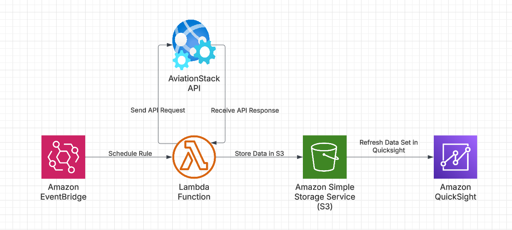

<h1> Air Travel API Pipeline </h1>
- (Still a work in progress)
  
<h2> Description </h2>
<b>This project focuses on obtaining air travel data from some of the most popular Canadian airports on a daily basis by using various AWS services and displaying them using Amazon Quicksight </b>
  

- Features used:
    - <b>AWS Lambda</b> : Uses AviationStack API to acquire flight information from specific Canadian airports and produces csv files as output
    - <b>AviationStack API</b> : An API to grab daily air travel information from select airports
    - <b>Amazon S3</b> : Stores the resulting csv files, directly written to by the lambda function
    - <b>Amazon EventBridge</b> : Scheduled to run the Lambda function at 00:00:00 UTC daily
    - <b>Amazon Quicksight</b> : Visually represents the dataset stored in our S3 bucket.
 
<b><u>Layout of the program</u></b>
  

<b>Example Dashboard Display Mar.21 - Mar.24 Data </b>
  

